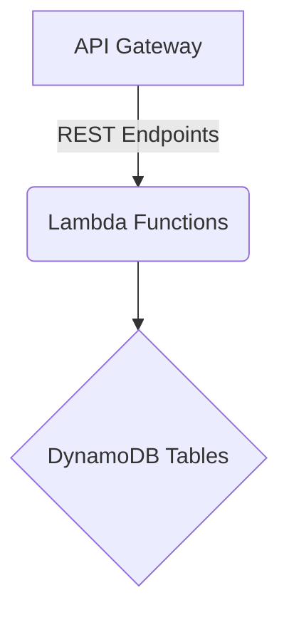

# FraudPy – Serverless Fraud-Monitoring Platform

FraudPy is a fully-serverless backend that helps you monitor transactions for fraud, enforce configurable spend/velocity **limits**, maintain **blacklists / watchlists**, and manage analyst **cases & reports** – all exposed through a REST API powered by AWS Lambda, API Gateway and DynamoDB.

> **Why “FraudPy”?**  
> Everything is written in Python 3.8 and deployed with AWS SAM.

---

## 💡 Key Features
| Domain | Purpose | Lambda folder |
|--------|---------|---------------|
| **Limits** | CRUD per-account / application / merchant / product spending limits (amount & count) | `limits/` |
| **Lists** | CRUD Blacklist, Watchlist & Stafflist entities for fast look-ups | `lists/` |
| **Evaluated Transactions** | Query fraud-scored transactions with on-the-fly aggregate enrichment | `evaluated_transactions/` |
| **Transaction Summary** | Lightweight reporting over processed transactions | `transactions_summary/` |
| **Case Management** | Open, update, close and report on analyst investigation cases | `case_management/` |

All data lives in three DynamoDB tables, names provided at deploy time:
* `FRAUD_LIMITS_TABLE`
* `FRAUD_LISTS_TABLE`
* `FRAUD_PROCESSED_TRANSACTIONS_TABLE`

---

## 🏗️ Architecture



* **template.yaml** (AWS SAM) wires API paths → Lambda handlers and grants least-privilege IAM permissions.  
* Each Lambda reads table names from environment variables and uses **boto3** for DB calls.  
* Responses are normalised by shared helpers so every HTTP reply looks like:

```json
{
  "responseCode": 200,
  "responseMessage": "Operation Successful",
  "data": { ... }
}
```

---

## 🚀 Deploy

Prerequisites: AWS CLI authenticated, SAM CLI, Python 3.8.

```bash
sam build --use-container
sam deploy --guided
```

SAM will ask for a unique **Stack Name** and region then create:

* API Gateway (Prod stage)  
* Lambda functions for every domain above  
* DynamoDB tables & IAM roles  

Copy the **ApiURL** output – that’s your base URL.

---

## 🔌 REST API Overview

| Method | Path | Handler | Description |
|--------|------|---------|-------------|
| ANY | `/limits/account` | `limits/lambda_handler.py` | Account-level limits |
| ANY | `/limits/account-application` | *same* | Account + Application limits |
| ANY | `/limits/account-application-merchant` | *same* | Account + Application + Merchant limits |
| ANY | `/limits/account-application-merchant-product` | *same* | Deepest granularity limits |
| POST | `/lists` | `lists/create.py` | Add entity to list |
| GET | `/lists` | `lists/read.py` | Query list(s) |
| PUT | `/lists` | `lists/update_2.py` | Update list entry |
| DELETE | `/lists` | `lists/delete.py` | Remove list entry |
| GET | `/evaluated-transactions` | `evaluated_transactions/app.py` | Query processed transactions |
| GET | `/transaction-summary` | `transactions_summary/app.py` | Aggregate stats |
| POST | `/case` | `case_management/app.py` | Open analyst case |
| PUT | `/case/status` | *same* | Update case status |
| GET | `/case` | *same* | Fetch single case |
| GET | `/cases/open` | *same* | List open cases |
| GET | `/cases/closed` | *same* | List closed cases |
| PUT | `/case/close` | *same* | Close case |
| POST | `/report` | *same* | File analyst report |

---

## 🧑‍💻 Local Development

```bash
sam local start-api
curl http://localhost:3000/limits/account?channel=MOBILE
```

SAM CLI emulates API Gateway & Lambda inside Docker, giving near-AWS parity.

---

## ✅ Testing

```bash
pip install -r tests/requirements.txt --user
python -m pytest tests/unit -v
# Integration tests (stack must be deployed)
AWS_SAM_STACK_NAME=<stack> python -m pytest tests/integration -v
```

---

## 🗂️ Repository Layout
```
limits/                    # Limit CRUD Lambdas + utils
lists/                     # List CRUD Lambdas
evaluated_transactions/    # Transaction query Lambda
transactions_summary/      # Summary Lambda
case_management/           # Case management Lambda
tests/                     # Unit & integration tests
template.yaml              # AWS SAM template
requirements.txt           # Shared libs for local dev
```

---

## 📝 Contributing

1. Fork & clone the repo.  
2. Create a feature branch: `git checkout -b feature/<name>`.  
3. Run tests and `sam build` locally.  
4. Submit a PR and ensure CI passes.

All code should be **black**-formatted and pytest-clean before merge.

---

## 📄 License
MIT – see `LICENSE` file for details.

- hello_world - Code for the application's Lambda function.
- events - Invocation events that you can use to invoke the function.
- tests - Unit tests for the application code. 
- template.yaml - A template that defines the application's AWS resources.

The application uses several AWS resources, including Lambda functions and an API Gateway API. These resources are defined in the `template.yaml` file in this project. You can update the template to add AWS resources through the same deployment process that updates your application code.

If you prefer to use an integrated development environment (IDE) to build and test your application, you can use the AWS Toolkit.  
The AWS Toolkit is an open source plug-in for popular IDEs that uses the SAM CLI to build and deploy serverless applications on AWS. The AWS Toolkit also adds a simplified step-through debugging experience for Lambda function code. See the following links to get started.

* [CLion](https://docs.aws.amazon.com/toolkit-for-jetbrains/latest/userguide/welcome.html)
* [GoLand](https://docs.aws.amazon.com/toolkit-for-jetbrains/latest/userguide/welcome.html)
* [IntelliJ](https://docs.aws.amazon.com/toolkit-for-jetbrains/latest/userguide/welcome.html)
* [WebStorm](https://docs.aws.amazon.com/toolkit-for-jetbrains/latest/userguide/welcome.html)
* [Rider](https://docs.aws.amazon.com/toolkit-for-jetbrains/latest/userguide/welcome.html)
* [PhpStorm](https://docs.aws.amazon.com/toolkit-for-jetbrains/latest/userguide/welcome.html)
* [PyCharm](https://docs.aws.amazon.com/toolkit-for-jetbrains/latest/userguide/welcome.html)
* [RubyMine](https://docs.aws.amazon.com/toolkit-for-jetbrains/latest/userguide/welcome.html)
* [DataGrip](https://docs.aws.amazon.com/toolkit-for-jetbrains/latest/userguide/welcome.html)
* [VS Code](https://docs.aws.amazon.com/toolkit-for-vscode/latest/userguide/welcome.html)
* [Visual Studio](https://docs.aws.amazon.com/toolkit-for-visual-studio/latest/user-guide/welcome.html)

## Deploy the sample application

The Serverless Application Model Command Line Interface (SAM CLI) is an extension of the AWS CLI that adds functionality for building and testing Lambda applications. It uses Docker to run your functions in an Amazon Linux environment that matches Lambda. It can also emulate your application's build environment and API.

To use the SAM CLI, you need the following tools.

* SAM CLI - [Install the SAM CLI](https://docs.aws.amazon.com/serverless-application-model/latest/developerguide/serverless-sam-cli-install.html)
* [Python 3 installed](https://www.python.org/downloads/)
* Docker - [Install Docker community edition](https://hub.docker.com/search/?type=edition&offering=community)

To build and deploy your application for the first time, run the following in your shell:

```bash
sam build --use-container
sam deploy --guided
```

The first command will build the source of your application. The second command will package and deploy your application to AWS, with a series of prompts:

* **Stack Name**: The name of the stack to deploy to CloudFormation. This should be unique to your account and region, and a good starting point would be something matching your project name.
* **AWS Region**: The AWS region you want to deploy your app to.
* **Confirm changes before deploy**: If set to yes, any change sets will be shown to you before execution for manual review. If set to no, the AWS SAM CLI will automatically deploy application changes.
* **Allow SAM CLI IAM role creation**: Many AWS SAM templates, including this example, create AWS IAM roles required for the AWS Lambda function(s) included to access AWS services. By default, these are scoped down to minimum required permissions. To deploy an AWS CloudFormation stack which creates or modifies IAM roles, the `CAPABILITY_IAM` value for `capabilities` must be provided. If permission isn't provided through this prompt, to deploy this example you must explicitly pass `--capabilities CAPABILITY_IAM` to the `sam deploy` command.
* **Save arguments to samconfig.toml**: If set to yes, your choices will be saved to a configuration file inside the project, so that in the future you can just re-run `sam deploy` without parameters to deploy changes to your application.

You can find your API Gateway Endpoint URL in the output values displayed after deployment.

## Use the SAM CLI to build and test locally

Build your application with the `sam build --use-container` command.

```bash
water_level_project$ sam build --use-container
```

The SAM CLI installs dependencies defined in `hello_world/requirements.txt`, creates a deployment package, and saves it in the `.aws-sam/build` folder.

Test a single function by invoking it directly with a test event. An event is a JSON document that represents the input that the function receives from the event source. Test events are included in the `events` folder in this project.

Run functions locally and invoke them with the `sam local invoke` command.

```bash
water_level_project$ sam local invoke HelloWorldFunction --event events/event.json
```

The SAM CLI can also emulate your application's API. Use the `sam local start-api` to run the API locally on port 3000.

```bash
water_level_project$ sam local start-api
water_level_project$ curl http://localhost:3000/
```

The SAM CLI reads the application template to determine the API's routes and the functions that they invoke. The `Events` property on each function's definition includes the route and method for each path.

```yaml
      Events:
        HelloWorld:
          Type: Api
          Properties:
            Path: /hello
            Method: get
```

## Add a resource to your application
The application template uses AWS Serverless Application Model (AWS SAM) to define application resources. AWS SAM is an extension of AWS CloudFormation with a simpler syntax for configuring common serverless application resources such as functions, triggers, and APIs. For resources not included in [the SAM specification](https://github.com/awslabs/serverless-application-model/blob/master/versions/2016-10-31.md), you can use standard [AWS CloudFormation](https://docs.aws.amazon.com/AWSCloudFormation/latest/UserGuide/aws-template-resource-type-ref.html) resource types.

## Fetch, tail, and filter Lambda function logs

To simplify troubleshooting, SAM CLI has a command called `sam logs`. `sam logs` lets you fetch logs generated by your deployed Lambda function from the command line. In addition to printing the logs on the terminal, this command has several nifty features to help you quickly find the bug.

`NOTE`: This command works for all AWS Lambda functions; not just the ones you deploy using SAM.

```bash
water_level_project$ sam logs -n HelloWorldFunction --stack-name water_level_project --tail
```

You can find more information and examples about filtering Lambda function logs in the [SAM CLI Documentation](https://docs.aws.amazon.com/serverless-application-model/latest/developerguide/serverless-sam-cli-logging.html).

## Tests

Tests are defined in the `tests` folder in this project. Use PIP to install the test dependencies and run tests.

```bash
water_level_project$ pip install -r tests/requirements.txt --user
# unit test
water_level_project$ python -m pytest tests/unit -v
# integration test, requiring deploying the stack first.
# Create the env variable AWS_SAM_STACK_NAME with the name of the stack we are testing
water_level_project$ AWS_SAM_STACK_NAME=<stack-name> python -m pytest tests/integration -v
```

## Cleanup

To delete the sample application that you created, use the AWS CLI. Assuming you used your project name for the stack name, you can run the following:

```bash
aws cloudformation delete-stack --stack-name water_level_project
```

## Resources

See the [AWS SAM developer guide](https://docs.aws.amazon.com/serverless-application-model/latest/developerguide/what-is-sam.html) for an introduction to SAM specification, the SAM CLI, and serverless application concepts.

Next, you can use AWS Serverless Application Repository to deploy ready to use Apps that go beyond hello world samples and learn how authors developed their applications: [AWS Serverless Application Repository main page](https://aws.amazon.com/serverless/serverlessrepo/)
