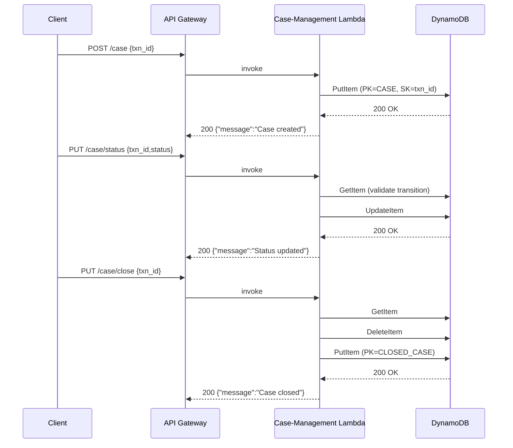

# Case-Management Service – Technical Specification

The Case-Management service is an **AWS Lambda** function (see `case_management/app.py`) exposed through **API Gateway** endpoints defined in `template.yaml`.  
It is responsible for creating, updating, querying and closing *fraud-investigation* cases that are stored in the shared **FRAUD_PROCESSED_TRANSACTIONS_TABLE** DynamoDB table.

---

## 1. DynamoDB Schema

| Attribute          | Type | Notes                                                                                                   |
|--------------------|------|----------------------------------------------------------------------------------------------------------|
| `PARTITION_KEY`    | S    | Constant values: `CASE` for open cases, `CLOSED_CASE` for closed cases.                                 |
| `SORT_KEY`         | S    | Equals the `transaction_id` (`transaction_id#uuid` for reports).                                        |
| `status`           | S    | Case status (`OPEN`, `IN_PROGRESS`, custom…).                                                           |
| `assigned_to`      | S    | Email / username of the investigator handling the case *(nullable)*.                                    |
| `created_at`       | S    | ISO-8601 timestamp of case creation.                                                                    |
| `updated_at`       | S    | ISO-8601 timestamp of last status update *(only set by `PUT /case/status`)*.                            |
| `closed_at`        | S    | ISO-8601 timestamp when case is closed *(only present on items in `CLOSED_CASE` partition)*.            |

**GSIs / LSIs** – none are required; all queries are performed via the **PK/SK** pattern.

---

## 2. API Endpoints

| Method | Path                 | Lambda Action              | Description |
|--------|----------------------|----------------------------|-------------|
| POST   | `/case`              | `create_case`              | Create a new case for a given `transaction_id`. |
| PUT    | `/case/status`       | `update_case_status`       | Update `status` and/or `assigned_to` of an existing case. |
| GET    | `/case`              | `get_case`                 | Retrieve a single case by `transaction_id`. |
| GET    | `/cases/open`        | `get_open_cases`           | List all open cases (`PARTITION_KEY = 'CASE'`). |
| GET    | `/cases/closed`      | `get_closed_cases`         | List all closed cases (`PARTITION_KEY = 'CLOSED_CASE'`). |
| PUT    | `/case/close`        | `close_case`               | Atomically move a case from *open* to *closed*. |
| POST   | `/report`            | `create_report`            | Attach an ad-hoc report to a case (`SORT_KEY = "{transaction_id}#{uuid}"`). |

All responses follow the wrapper produced by `response()` in `case_management/app.py`:

```json
{
  "responseCode": 200,
  "responseMessage": "Operation Successful",
  "data": { ... }
}
```

### 2.1. POST /case

```http
POST /case
Content-Type: application/json

{
  "transaction_id": "TXN123456",
  "assigned_to": "fraud.analyst@example.com",
  "status": "OPEN"
}
```

Success ⇒ `200 OK`

```json
{
  "message": "Case created successfully",
  "case_id": "TXN123456"
}
```

### 2.2. PUT /case/status

```http
PUT /case/status
Content-Type: application/json

{
  "transaction_id": "TXN123456",
  "assigned_to": "fraud.lead@example.com",
  "status": "IN_PROGRESS"
}
```

### 2.3. GET /case

```http
GET /case?transaction_id=TXN123456
```

### 2.4. PUT /case/close

```http
PUT /case/close
Content-Type: application/json

{
  "transaction_id": "TXN123456"
}
```

The Lambda performs:

1. `GET` the open-case item (`PK='CASE'`).
2. `DELETE` the open-case item.
3. `PUT` a new item with `PK='CLOSED_CASE'`, preserving `status`, `created_at`, adding `closed_at`.

Atomicity is guaranteed at the **application level**, not via DynamoDB transactions.

---

## 3. Error Handling

| HTTP | Reason                                    |
|------|-------------------------------------------|
| 400  | Missing required fields / invalid params. |
| 404  | Case not found.                           |
| 500  | Unhandled exception (logged via `print`). |

---

## 4. Security & IAM

The Lambda execution role **must** allow:

```yaml
dynamodb:PutItem
dynamodb:GetItem
dynamodb:DeleteItem
dynamodb:UpdateItem
dynamodb:Query
```

Scope can be limited to the `FRAUD_PROCESSED_TRANSACTIONS_TABLE` ARN.

---

## 5. Open Items / TODO

* Pagination for `/cases/open` and `/cases/closed`.
* Validation of `status` transitions (e.g., OPEN → IN_PROGRESS → CLOSED).
* Replace **print** debugging with structured logging (AWS X-Ray / CloudWatch).
* Add unit tests for each handler in `tests/unit/`.

---

## 6. Sequence Diagram


