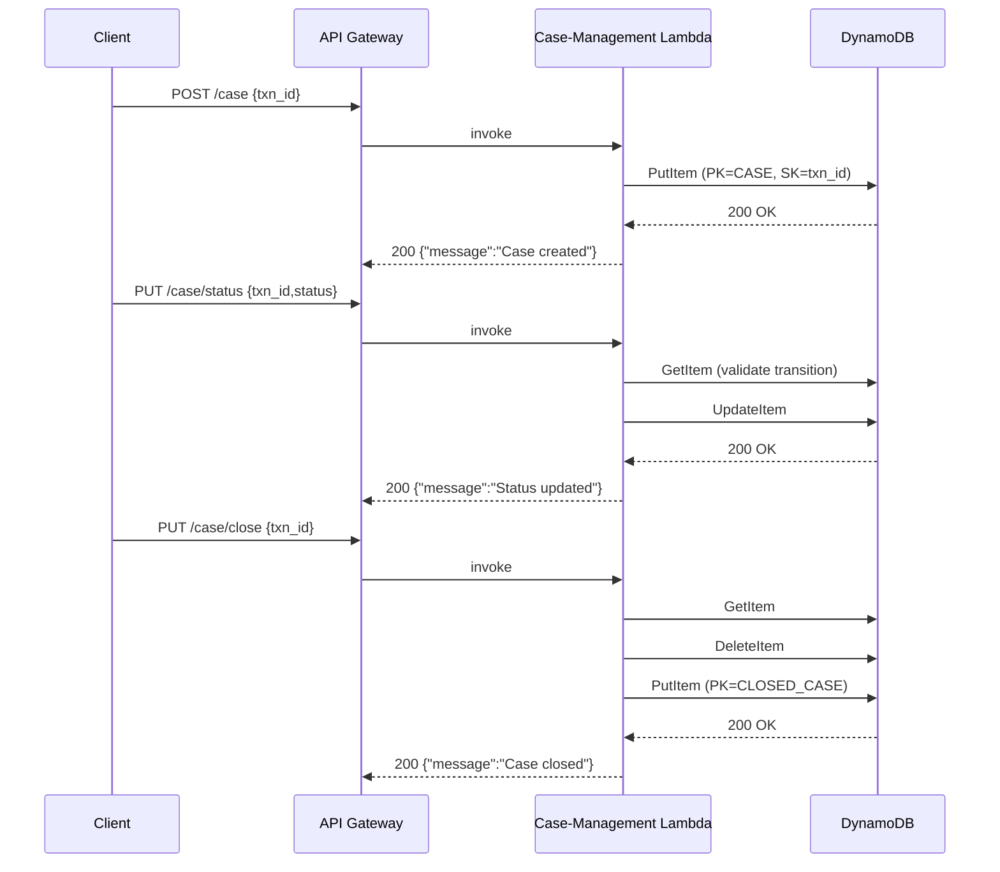

# Case-Management Service – Technical Specification

The Case-Management service is an **AWS Lambda** function (see `case_management/app.py`) exposed through **API Gateway** endpoints defined in `template.yaml`.  
It is responsible for creating, updating, querying and closing *fraud-investigation* cases that are stored in the shared **FRAUD_PROCESSED_TRANSACTIONS_TABLE** DynamoDB table.

---

## 1. DynamoDB Schema

| Attribute          | Type | Notes                                                                                                   |
|--------------------|------|----------------------------------------------------------------------------------------------------------|
| `PARTITION_KEY`    | S    | Constant values: `CASE` for open cases, `CLOSED_CASE` for closed cases.                                 |
| `SORT_KEY`         | S    | Equals the `transaction_id` (`transaction_id#uuid` for reports).                                        |
| `status`           | S    | Case status (`OPEN`, `IN_PROGRESS`, custom…).                                                           |
| `assigned_to`      | S    | Email / username of the investigator handling the case *(nullable)*.                                    |
| `created_at`       | S    | ISO-8601 timestamp of case creation.                                                                    |
| `updated_at`       | S    | ISO-8601 timestamp of last status update *(only set by `PUT /case/status`)*.                            |
| `closed_at`        | S    | ISO-8601 timestamp when case is closed *(only present on items in `CLOSED_CASE` partition)*.            |

**GSIs / LSIs** – none are required; all queries are performed via the **PK/SK** pattern.

---

## 2. API Endpoints

| Method | Path                     | Lambda Action      | Detailed description |
|--------|--------------------------|--------------------|----------------------|
| **POST** | `/case`                | `create_case`      | Register a *brand-new* investigation record in the **open-case** partition. The handler rejects duplicate `transaction_id`s and stamps `created_at`, optional `assigned_to`, and optional initial `status` (`OPEN` by default). |
| **PUT**  | `/case/status`         | `update_case_status` | Mutate the investigator assignment and/or lifecycle `status`. The handler enforces allowed transitions (`OPEN → IN_PROGRESS → CLOSED`) and writes an `updated_at` timestamp on success. |
| **GET**  | `/case`                | `get_case`         | Fetch a *single* case (open **or** closed) by `transaction_id`. 404 is returned when the ID is absent in both partitions. |
| **GET**  | `/cases/open`          | `get_open_cases`   | Paginated listing of every case whose `PARTITION_KEY` =`CASE`. Supports `limit` and `last_evaluated_key` for forward paging. |
| **GET**  | `/cases/closed`        | `get_closed_cases` | Same pagination interface as above but scans the `CLOSED_CASE` partition. |
| **PUT**  | `/case/close`          | `close_case`       | Atomically *moves* a case from the open partition to `CLOSED_CASE`, keeps original metadata, and appends a `closed_at` timestamp. Idempotent—calling twice returns **404** on the second call. |
| **POST** | `/report`              | `create_report`    | Adds a child item under the same partition with composite sort-key `transaction_id#<uuid>`. Reports carry no business attributes beyond timestamps; they act as immutable audit attachments. |

All responses follow the wrapper produced by `response()` in `case_management/app.py`:

```json
{
  "responseCode": 200,
  "responseMessage": "Operation Successful",
  "data": { ... }
}
```

### 2.1 POST / case – *Create case*

**Key points**

- Creates a new *open* case (PK =`CASE`) for the supplied `transaction_id`.
- Optional fields:  
  - `status` *(defaults to `OPEN`)*  
  - `assigned_to` *(username / email of investigator)*
- Rejects if the case already exists.

**Request**

```http
POST /case
Content-Type: application/json
```

```json
{
  "transaction_id": "TXN123456",
  "assigned_to": "fraud.analyst@example.com",
  "status": "OPEN"
}
```

**Successful response – 200**

```json
{
  "responseCode": 200,
  "responseMessage": "Operation Successful",
  "data": {
    "message": "Case created successfully",
    "case_id": "TXN123456"
  }
}
```

---

### 2.2 PUT / case/status – *Update status / assignee*

**Key points**

- Validates status transitions (`OPEN → IN_PROGRESS`, `OPEN/IN_PROGRESS → CLOSED`).
- Updates `updated_at` timestamp on every mutation.
- Returns **400** for invalid transition or unknown status.

**Request**

```http
PUT /case/status
Content-Type: application/json
```

```json
{
  "transaction_id": "TXN123456",
  "assigned_to": "fraud.lead@example.com",
  "status": "IN_PROGRESS"
}
```

**Successful response – 200**

```json
{
  "responseCode": 200,
  "responseMessage": "Operation Successful",
  "data": {
    "message": "Case status updated successfully"
  }
}
```

---

### 2.3 GET / case – *Retrieve single case*

**Key points**

- Query-string parameter `transaction_id` **required**.
- Searches the open-case partition first, fallback to closed.

**Request**

```http
GET /case?transaction_id=TXN123456
```

**Successful response – 200**

```json
{
  "responseCode": 200,
  "responseMessage": "Operation Successful",
  "data": {
    "transaction_id": "TXN123456",
    "status": "IN_PROGRESS",
    "assigned_to": "fraud.lead@example.com",
    "created_at": "2025-07-03T10:15:00.123456",
    "updated_at": "2025-07-03T11:00:00.000000"
  }
}
```

---

### 2.4 PUT / case/close – *Close case*

**Key points**

- Atomically moves item from `CASE` to `CLOSED_CASE` partition.
- Sets `closed_at` timestamp.
- Idempotent: returns **404** when the case is not open.

**Request**

```http
PUT /case/close
Content-Type: application/json
```

```json
{
  "transaction_id": "TXN123456"
}
```

**Successful response – 200**

```json
{
  "responseCode": 200,
  "responseMessage": "Operation Successful",
  "data": {
    "message": "Case closed successfully"
  }
}
```

---

### 2.5 GET / cases/open – *List open cases*

**Key points**

- Supports **cursor-based pagination** (`limit`, `last_evaluated_key`).
- Default `limit` is **25**.

**Request**

```http
GET /cases/open?limit=25
```

**Successful response – 200**

```json
{
  "responseCode": 200,
  "responseMessage": "Operation Successful",
  "data": {
    "open_cases": [
      {
        "transaction_id": "TXN123456",
        "status": "OPEN",
        "assigned_to": "fraud.analyst@example.com",
        "created_at": "2025-07-03T10:15:00.123456"
      }
    ],
    "last_evaluated_key": {
      "PARTITION_KEY": "CASE",
      "SORT_KEY": "TXN123456"
    }
  }
}
```

---

### 2.6 GET / cases/closed – *List closed cases*

**Key points**

- Paginates exactly like `/cases/open`.
- Items retain original `created_at` plus `closed_at`.

**Request**

```http
GET /cases/closed
```

**Successful response – 200**

```json
{
  "responseCode": 200,
  "responseMessage": "Operation Successful",
  "data": {
    "closed_cases": [
      {
        "PARTITION_KEY": "CLOSED_CASE",
        "SORT_KEY": "TXN123456",
        "status": "CLOSED",
        "created_at": "2025-06-16T09:12:00.000000",
        "closed_at": "2025-06-17T08:05:00.000000"
      }
    ],
    "last_evaluated_key": null
  }
}
```

---

### 2.7 POST / report – *Attach report to case*

**Key points**

- Creates an item with composite sort-key `transaction_id#uuid`.
- Allows unlimited reports per case.

**Request**

```http
POST /report
Content-Type: application/json
```

```json
{
  "transaction_id": "TXN123456"
}
```

**Successful response – 200**

```json
{
  "responseCode": 200,
  "responseMessage": "Operation Successful",
  "data": {
    "message": "Report created successfully",
    "report_id": "TXN123456#550e8400-e29b-41d4-a716-446655440000"
  }
}
```

---

### 2.8 Pagination parameters (all list endpoints)

| Query Parameter      | Type | Description                                               |
|----------------------|------|-----------------------------------------------------------|
| `limit`              | int  | Maximum number of items to return (default **25**).       |
| `last_evaluated_key` | json | The `LastEvaluatedKey` value from the previous response. |

Example:

```http
GET /cases/open?limit=50&last_evaluated_key={"PARTITION_KEY":"CASE","SORT_KEY":"TXN123"}
```

---

```http
POST /case
Content-Type: application/json

{
  "transaction_id": "TXN123456",
  "assigned_to": "fraud.analyst@example.com",
  "status": "OPEN"
}
```

Success ⇒ `200 OK`

```json
{
  "message": "Case created successfully",
  "case_id": "TXN123456"
}
```

### 2.2. PUT /case/status

```http
PUT /case/status
Content-Type: application/json

{
  "transaction_id": "TXN123456",
  "assigned_to": "fraud.lead@example.com",
  "status": "IN_PROGRESS"
}
```

### 2.3. GET /case

```http
GET /case?transaction_id=TXN123456
```

### 2.4. PUT /case/close

```http
PUT /case/close
Content-Type: application/json

{
  "transaction_id": "TXN123456"
}
```

The Lambda performs:

1. `GET` the open-case item (`PK='CASE'`).
2. `DELETE` the open-case item.
3. `PUT` a new item with `PK='CLOSED_CASE'`, preserving `status`, `created_at`, adding `closed_at`.

Atomicity is guaranteed at the **application level**, not via DynamoDB transactions.

### 2.5 GET /cases/open

```http
GET /cases/open?limit=25
```

Success ⇒ `200 OK`

```json
{
  "responseCode": 200,
  "responseMessage": "Operation Successful",
  "data": {
    "open_cases": [
      {
        "transaction_id": "TXN123456",
        "status": "OPEN",
        "assigned_to": "fraud.analyst@example.com",
        "created_at": "2025-07-03T10:15:00.123456"
      }
    ],
    "last_evaluated_key": {
      "PARTITION_KEY": "CASE",
      "SORT_KEY": "TXN123456"
    }
  }
}
```

### 2.6 GET /cases/closed

```http
GET /cases/closed
```

Success ⇒ `200 OK`

```json
{
  "responseCode": 200,
  "responseMessage": "Operation Successful",
  "data": {
    "closed_cases": [
      {
        "PARTITION_KEY": "CLOSED_CASE",
        "SORT_KEY": "TXN123456",
        "status": "CLOSED",
        "created_at": "2025-06-16T09:12:00.000000",
        "closed_at": "2025-06-17T08:05:00.000000"
      }
    ],
    "last_evaluated_key": null
  }
}
```

### 2.7 POST /report

```http
POST /report
Content-Type: application/json

{
  "transaction_id": "TXN123456"
}
```

Success ⇒ `200 OK`

```json
{
  "responseCode": 200,
  "responseMessage": "Operation Successful",
  "data": {
    "message": "Report created successfully",
    "report_id": "TXN123456#550e8400-e29b-41d4-a716-446655440000"
  }
}
```

### 2.8 Pagination

Both `/cases/open` and `/cases/closed` support **cursor-based pagination** using
standard DynamoDB patterns:

| Query Parameter      | Type | Description                                               |
|----------------------|------|-----------------------------------------------------------|
| `limit`              | int  | Maximum number of items to return (default **25**).       |
| `last_evaluated_key` | json | The `LastEvaluatedKey` value from the previous response. |

Example:

```http
GET /cases/open?limit=50
```

```http
GET /cases/open?limit=50&last_evaluated_key={"PARTITION_KEY":"CASE","SORT_KEY":"TXN123"}
```

---

## 3. Error Handling

| HTTP | Reason                                    |
|------|-------------------------------------------|
| 400  | Missing required fields / invalid params. |
| 404  | Case not found.                           |
| 500  | Unhandled exception (logged via `print`). |

---

## 4. Security & IAM

The Lambda execution role **must** allow:

```yaml
dynamodb:PutItem
dynamodb:GetItem
dynamodb:DeleteItem
dynamodb:UpdateItem
dynamodb:Query
```

Scope can be limited to the `FRAUD_PROCESSED_TRANSACTIONS_TABLE` ARN.

---

## 5. Open Items / TODO

* Migrate remaining `print` statements to structured logging (AWS X-Ray / CloudWatch).
* Add unit tests for each handler in `tests/unit/`.

---

## 6. Sequence Diagram


